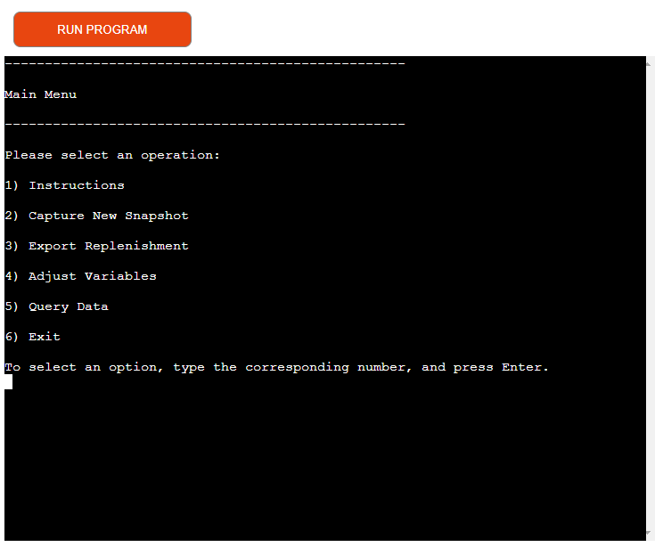
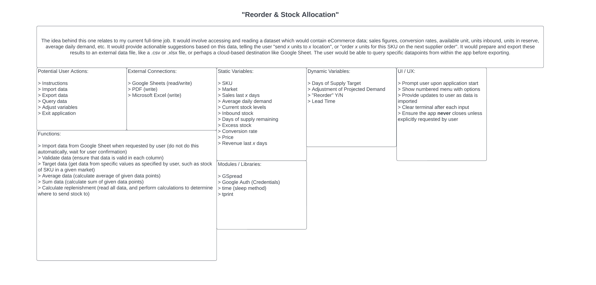
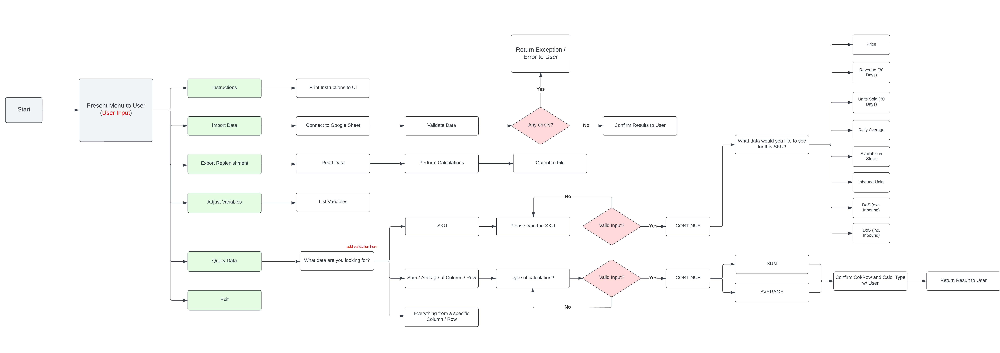
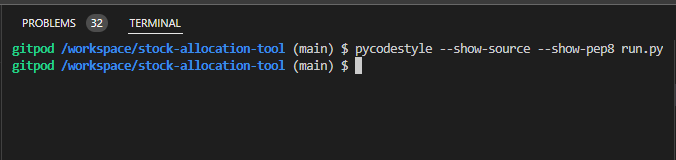
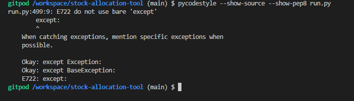
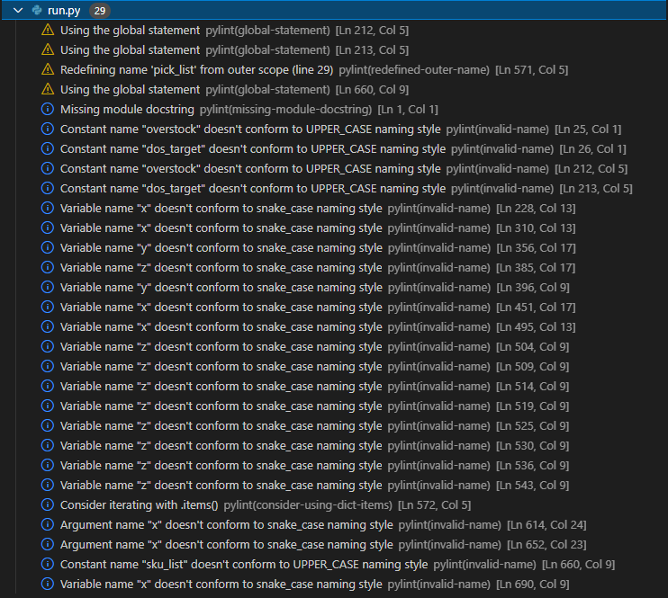
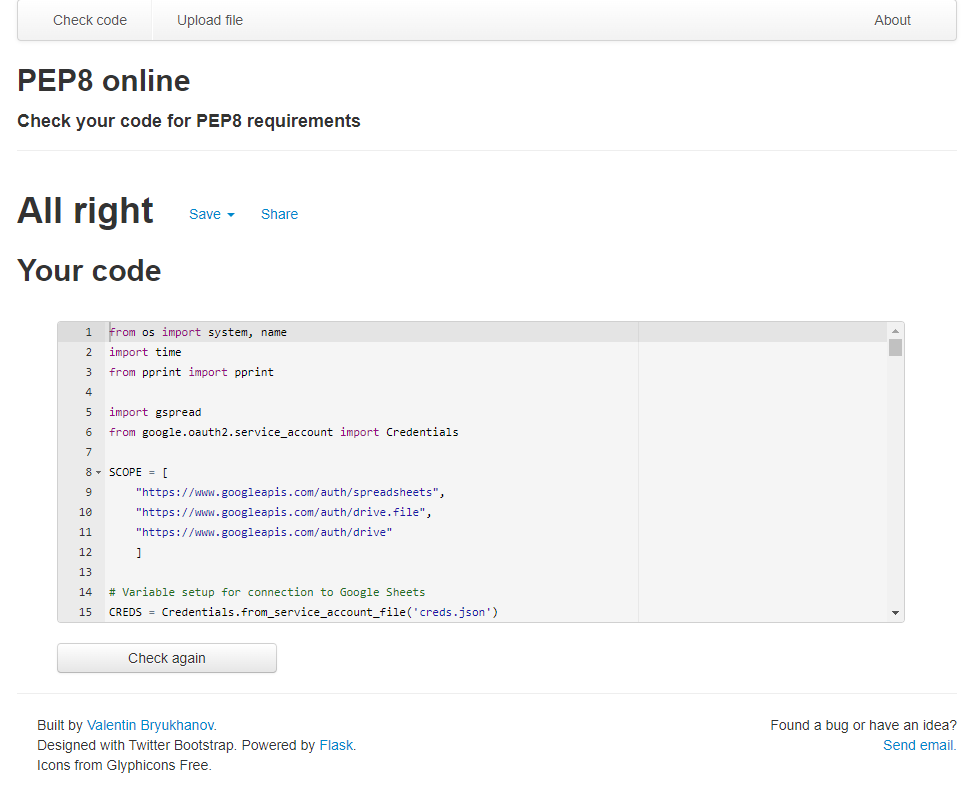

# Stock Allocation Tool

## By Samuel Masters

#### This project was developed to act as my third portfolio project, based on Python Essentials, as part of my Diploma in Software Development with Code Institute.

### [Click here to view the deployed application.](https://stock-allocation-tool-ci.herokuapp.com/)

### [Click here to view the public repository.](https://github.com/SamuelMasters/stock-allocation-tool)

---

# Table of Contents:

1. [The Why](#the-why)
2. [User Experience(UX)](##user-experience-(ux))
   1. [Target Audience](#target-audience)
   2. [Strategy](#strategy)
   3. [Scope](#scope)
   4. [Structure](#structure)
   5. [Skeleton](#skeleton)
      1. [Wireframes](#wireframes)
   6. [Surface](#surface)
3. [Features](#features)
   1. [Current Features](#current-features)
   2. [Future Features](#future-features)
4. [Technologies](#technologies)
5. [Testing](#testing)
   1. [Tests](#tests)
   2. [Bugs & Fixes](#bugs-&-fixes)
6. [Deployment](#deployment)
   1. [GitHub & GitPod](##gitpod)
   2. [Heroku](##heroku)
7. [Credits](#credits)

# Project Objective & Purpose

The purpose of this Python application is to serve a business need, that is, recommending stock to be sent to each market for a variety of different SKUs.

The objective is to further my own education and knowledge of the Python language, as well as to serve as a proof of concept of what a larger project of a similar purpose could start with. 

# User Experience (UX)

## Target Audience

- Small businesses selling products in multiple markets. 
- Retail or eCommerce businesses looking to maintain optimal stock levels.

## Strategy

To create an simple application that accesses inventory and sales data, and uses it to quickly and easily calculate recommendations for outgoing quantities for each SKU, in each market, with the business aim being to maintain stock levels. Additionally, the application should let users customise the parameters used in those calculations, and let them read the data points that are contributing to the calculation.

### Project Goals

- To provide quick and easy restock recommendations.
- To allow users to read the specific datapoints from the connected dataset. 
- To allow users to customise the parameters used in the key restock calculation.

## Scope:

The scope of the Stock Allocation Tool application at the time of submission is as set out by the features below:

- Connection to and caching of an external dataset located in Google Sheets. 
- Instructions accessible from the main menu which inform the user about the use of the application, and what each option on the main menu does. 
- Calculation of recommended replenishment for each SKU in the connected dataset. 
- A query data function which allows users to view specific data points for each SKU, as well as calculate basic mathematical operations on numerical dataset columns. 

If this project were to be revisited in the future, the following features would be considered:

- Adding a fully-fledged graphic user interface (GUI) to the application, rather than having the application run solely with a command line interface (CLI). A dedicated GUI would allow for simultaneous display of different data points and an improved user experience. 
- The ability to export the results of the restock calculations to a .csv or .txt file on the user's local system, as well as to let them define the file path for where this file would be exported to. 

## Structure

The application's structure is set within a command line interface. It starts with a simple welcome screen, and messages printed to the console which inform the user about the application's initial caching of external data. The main menu then provides the user with various options on how to proceed. 

Sub-menus are housed within the Adjust Variables and Query Data top-menu options. These sub-menus allow the user to choose what variable they wish to change or what type of data they want to examine, respectively. 

- Main Menu
  - Instructions
  - Capture New Snapshot
  - Export Replenishment
  - Adjust Variables
    - Overstock
    - Days of Supply Target
    - Return to Main Menu
  - Query Data
    - Specific SKU Data
    - SUM, AVERAGE or RANGE of entire numerical column
    - All values from one row
    - Return to Main Menu
  - Exit

## Skeleton

### Wireframes

At the project outset, [Lucidchart](https://www.lucidchart.com/pages/) was used to create an inital foundation of the idea. It included information on inital thoughts on how the user might interact with the application, what Python libraries or modules may be required, what sort of variables may need to be involved, whether those variables should be static or dynamic (user-configurable), and what functions may need to be created to handle different operations within the application. 

The below images show how the wireframing process formed. 

The inital considerations were mapped out as different text fields as seen here: 
 

 The navigation and process of the application was similarly visualised, this time as a flow chart:
 

## Surface

### Colours, Typography, Imagery

The entire application sits and works within a command line interface, therefore design considerations were generally minimal within the scope of this project. Instead, the user experience received more focus, resulting in considerations like how the user may navigate the menus, how they might understand the information presented to them, and keeping the terminal clear to help maintain high readability. 

---

# Features

## Current Features

- Connection to a mutable external dataset containing relevant inventory data. 
- In-app calculation and output of recommended units to restock for each SKU in the external dataset. 
- The ability to query specific datapoints from the dataset, from within the app itself (as opposed to having to view the dataset itself separately).
- Calculation and output of basic mathematical operations conducted on numerical columns from the external dataset.  

## Future Features

- A migration from the command-line interface to a fully fledged graphical user interface instead, allowing for more user-friendly presentation of data and output. 
- The ability to generate an external document containing the results of the restock calculations, and for the user to choose where this file should be saved. 

# Technologies

## Languages

- [Python](https://www.python.org/)

## Other Technologies, Frameworks & Libraries

### Native Modules & Libaries
- [os](https://docs.python.org/3/library/os.html)
  - Used to provide the requisite functions for the clear() function to work.
- [time](https://docs.python.org/3/library/time.html?highlight=time#module-time)
  - Used to create short delays throughout the application to improve the user experience.
- [pprint](https://docs.python.org/3/library/pprint.html?highlight=pprint#module-pprint)
  - Used to more elegantly present long lists and other data structures to the user in the terminal. 

### External Modules & Libraries
- [GSpread](https://docs.gspread.org/en/latest/#)
  - API for Google Sheets which allowed for reading of the sole external dataset.
- [Google Auth](https://google-auth.readthedocs.io/en/master/)
  - Used in conjunction with GSpread, this allowed the application to gain permission and access to the external dataset. 

# Testing

## Tests

### Flake8, Pylint

The [Code Institute](https://github.com/Code-Institute-Org/python-essentials-template) Python template was used to setup the IDE with the necessary plugins and linters. Errors were checked using the [Flake8](https://flake8.pycqa.org/en/latest/#) and [Pylint](https://pylint.pycqa.org/en/latest/) tools within the IDE, and at the time of project submission, the code was checked for errors using [pycodestyle](https://books.agiliq.com/projects/essential-python-tools/en/latest/linters.html), formally PEP8, as the official linter tool. 

Additionally, an online tool called [PEP8 Online](http://pep8online.com/) was used to check that the code within run.py adheres to PEP8 requriements, and flagged no errors. 

### [pycodestyle](https://validator.w3.org/)

The run.py file in which the project was written did not flag any error after the pycodestyle command was called to check for errors. 
  

Though the above image shows no output from the command, this screenshot proves that the command does flag legitimate errors. The error mentioned here was due to an erroneous except statement in run.py, which was resolved after appearing here.  
 

### [Flake8](https://flake8.pycqa.org/en/latest/) & [Pylint](https://pylint.pycqa.org/en/latest/)

The Flake8 and Pylint linters did not flag any major errors at the time of project submission, though some minor advisories were present. These were left unresolved as some of these appeared to be false positives (such as believing a variable to be a constant when it was not intended) while others were valid, but did not impact the functionality of the application nor did they flag when being checked with the official linter as above. 

### [PEP8 Online](http://pep8online.com/)

The online tool PEP8 Online did not flag any errors at the time of project submission.

## Bugs & Fixes

1. Fixed -- Unintended sku_list variable growth
   - The variable 'sku_list' is used within the project as a list data structure, containing the SKU values of every row from the connnected dataset. The dataset was automatically cached once upon the application loading. It was discovered that if a user subsequently requested a fresh snapshot of the dataset through the "Capture New Snapshot" option on the main menu, the sku_list would not clear out it's previous contents, and would instead append all SKUs from the dataset again, resulting in duplicates. This was resolved by reassigning the sku_list variable as an empty list at every call of the capture_data() function, which cleaned out the variable before fetching new values each time. 
2. Fixed -- Leftover 'hanging' text within terminal
   - Throughout the project a clear() function was used to routinely clear the terminal in an effort to keep the interface clean for the user. It was discovered through testing that when terminal output exceeded the total length of the terminal window, resulting in a scroll bar appearing, this led to some leftover text remaining above the terminal once clear() had been called. This was a particular problem for the instructions() function, which printed long blocks of text to the terminal. This unintentional effect was resolved by adding additional call() statements after long blocks of text, to prevent the terminal from reaching an overflow point. It should be noted however that if the user continually enters invalid input throughout the application resulting in error messages, these stack and may eventually cause unintentional overflow at the top of the page (though it is 'hidden' from the user after they provide valid input and proceed through the menus). This is something to be addressed in later iterations of this project. 

# Deployment

## Gitpod
Gitpod was used as the IDE for this project. 

It can be setup via the following steps:

1. Install the Gitpod browser extension [here](https://chrome.google.com/webstore/detail/gitpod-always-ready-to-co/dodmmooeoklaejobgleioelladacbeki).
2. Navigate to your GitHub account and log in. 
3. Navigate to your own repository. 
4. Click the green 'Gitpod' button near the top of the page. 
5. If you have cloned or forked the repository for this project, please use 'pip3 install -r requirements.txt' in the terminal to install external modules and libraries that were used for this project and are not included in vanilla Python. 

## Cloning the repository

If you wish to clone the repository to make a dynamic copy of this project, you may do so via the following steps: 

1. Navigate to your GitHub account and log in. 
2. Navigate to the [repository](https://github.com/SamuelMasters/stock-allocation-tool). 
3. Click 'Code', and on the dropdown menu, click the copy icon alongside the provided URL. 
4. Open Gitpod in your own repository, and open a terminal. 
5. Type 'git clone ' followed by the URL you copied in the previous steps.
6. Press Enter to finish cloning of the repository.  

## Forking the repository

If you wish to fork the repository to make a static, independent copy of this project, you may do so via the following steps: 

1. Navigate to your GitHub account and log in. 
2. Navigate to the [repository](https://github.com/SamuelMasters/stock-allocation-tool). 
3. In the top-right corner, click 'Fork'. 
4. You should now have a copy of the original repository amongst your other repositories. 

Copying a repository in this way allows you to make changes to the code without affecting the original project, and can be useful for experimentation. 

## Heroku

Heroku was used to deploy this project. 

It was achieved via the following steps: 

1. Navigate to your Heroku dashboard and log in.
2. From the Heroku dashboard, click the 'New' button on the top-right of the page, and click 'Create New App' from the dropmenu menu that follows. 
3. Assign a name to your application and select your region, and click "Create App" once finished. 
4. From the top navbar, navigate to Settings, then scroll down to "Config Vars". This project required credentials to access Google Sheet data, so as a key : value pair, "CREDS" was entered as a key, and the private credential data was copied into the value field. 
5. Underneath "Config Vars", scroll down to "Buildpacks". Select "Add buildback" and add whichever buildpacks are required for your application. For this project, the Python and NodeJS buildpacks were added, in that order. 
6. At the top navbar, move to Deploy. Select "Github", and connect your accounts if prompted through the guidance provided. Once your accounts are connected, choose whether to enable "Automatic deployment" - this will tell Heroku to rebuild your application each time you push an update to your project repository on Github. For the first deployment, whether or not automatic deployments were enabled, click on Manual deploys to use the current state of your repository to build your application in Heroku. 
7. Once your project has been deployed, Heroku will provide a button to view your deployed project. 

---

# Credits

1. [Code Institute](https://codeinstitute.net/)
   - For providing me with the knowledge and skills to develop this project, and for supporting my learning journey.  
2. [Chris Quinn](https://github.com/10xOXR)
   - Thank you Chris for your continued advice and assistance with my work, it is greatly appreciated.    
3. [Geeks for Geeks](https://www.geeksforgeeks.org/clear-screen-python/)
   - The code provided by @mohit_negi in this article was adapted for use in my own work, and the information within the article informed me of how the script worked. The docstring for the clear() function in run.py contains a link to the page. 
4. [Lucidchart](https://www.lucidchart.com/pages/)
   - This service was ideal for outlining ideas and considerations at the outset of this project. The tools provided within the service allowed for useful visualisation of application flow, which in turn provided important direction when it came to time to start writing the code itself. 
